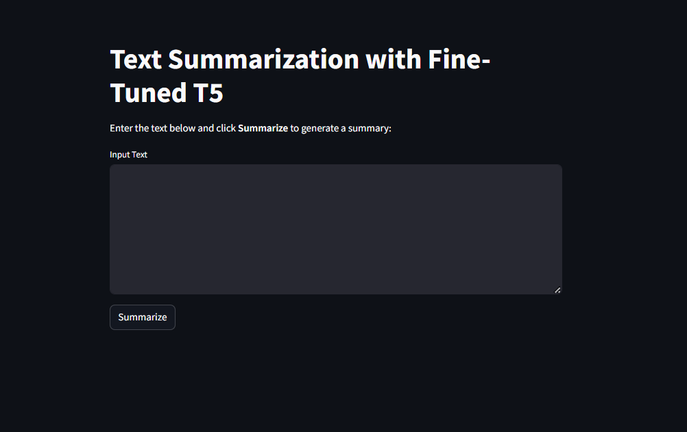
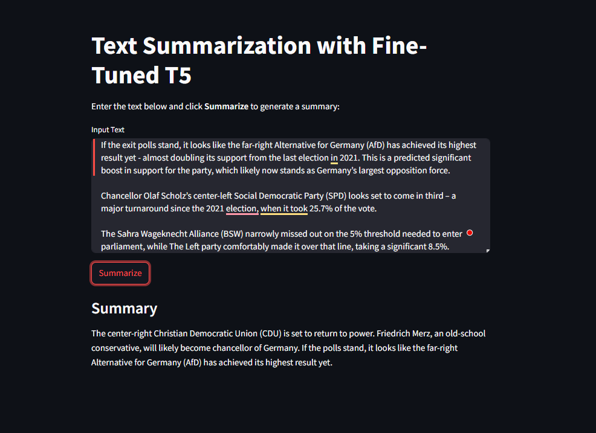
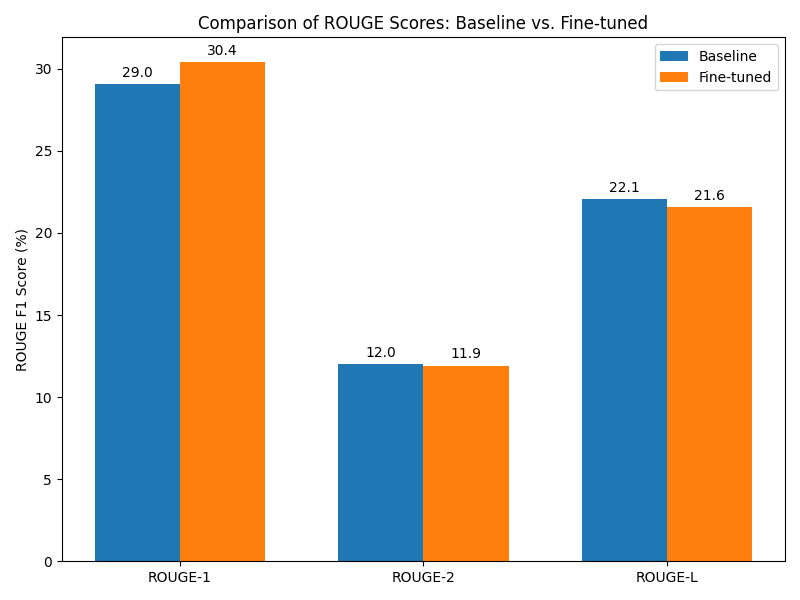

<!DOCTYPE html>
<html lang="en">
<head>
    <meta charset="UTF-8">
    <meta name="viewport" content="width=device-width, initial-scale=1.0">
    <title>Text Summarization with Fine-Tuned T5</title>
</head>
<body>

<h1>Text Summarization with Fine-Tuned T5</h1>

This project provides a <b>text summarization</b> web app using a fine-tuned <b>T5 model</b>. The web interface is built with <b>Streamlit</b>, while the model is trained and evaluated using <b>Hugging Face Transformers</b>. The fine-tuned model shows slight improvements over the baseline, as seen in <b>ROUGE score comparisons</b>.

<b>Note:</b> This project is for <b>educational purposes</b>, and the model has been trained with limited data and epochs. Further training can enhance performance.

<h2>Table of Contents</h2>
<ul>
    <li><a href="#installation">Installation</a></li>
    <li><a href="#usage">Usage</a></li>
    <li><a href="#fine-tuning-the-model">Fine-Tuning the Model</a></li>
    <li><a href="#understanding-the-code">Understanding the Code</a>
        <ul>
            <li><a href="#1-web-app-apppy">1. Web App (<code>app.py</code>)</a></li>
            <li><a href="#2-training-script-trainpy">2. Training Script (<code>train.py</code>)</a></li>
        </ul>
    </li>
    <li><a href="#results-and-improvements">Results and Improvements</a></li>
    <li><a href="#acknowledgments">Acknowledgments</a></li>
</ul>

<h2 id="installation">Installation</h2>

First, clone this repository:

<pre><code>git clone https://github.com/yourusername/text-summarization-t5.git
cd text-summarization-t5
</code></pre>

<h3>1. Install Dependencies</h3>

All required packages are listed in <code>requirements.txt</code>. Install them using:

<pre><code>pip install -r requirements.txt</code></pre>

<h3>2. Run the Web Application</h3>

To start the <b>Streamlit</b> web app:

<pre><code>streamlit run app.py</code></pre>

Then open the provided local URL in your browser.

<h2 id="usage">Usage</h2>

1. Open the web application.

2. Enter a long piece of text in the text area.

3. Click the <b>Summarize</b> button.

4. The model will generate a summarized version of the input text.

<h3>Deployment Illustration</h3>

Below are images illustrating the deployed web application:

<b>Initial Web App View:</b>

<b>Example of Summarized Output:</b>

<h2 id="fine-tuning-the-model">Fine-Tuning the Model</h2>

Since this project is for <b>educational purposes</b>, the model has been fine-tuned for only a few epochs. More training can <b>improve</b> summarization quality.

To fine-tune the model with more data:

<ul>
    <li>Use a <b>larger dataset</b> (e.g., CNN/DailyMail).</li>
    <li>Increase the <b>number of training epochs</b>.</li>
    <li>Optimize <b>learning rate and batch size</b>.</li>
</ul>

The fine-tuning process is detailed in <code>train.py</code>.

<h2 id="understanding-the-code">Understanding the Code</h2>

<h3 id="1-web-app-apppy">1. Web App (<code>app.py</code>)</h3>

This script:

<ul>
    <li>Loads the <b>fine-tuned T5 model</b> from the Hugging Face Hub.</li>
    <li>Uses <b>Streamlit</b> for a simple UI.</li>
    <li>Accepts input text, generates a summary, and displays the result.</li>
</ul>

<h3 id="2-training-script-trainpy">2. Training Script (<code>train.py</code>)</h3>

This script fine-tunes a <b>T5-small</b> model on the <b>CNN/DailyMail</b> dataset.

<b>Key Steps:</b>

<ul>
    <li><b>Load the dataset:</b> Uses CNN/DailyMail dataset.</li>
    <li><b>Preprocess data:</b> Tokenizes articles and highlights (summaries).</li>
    <li><b>Train the model:</b> Uses Trainer API with optimized parameters.</li>
    <li><b>Evaluate performance:</b> Compares fine-tuned model with baseline T5.</li>
    <li><b>Plot results:</b> Generates <b>rouge_comparison.png</b> to visualize improvements.</li>
</ul>

<h2 id="results-and-improvements">Results and Improvements</h2>

A <b>comparison of ROUGE scores</b> between the baseline and fine-tuned models is shown in <b>rouge_comparison.png</b>:

<ul>
    <li><b>ROUGE-1 improved</b> from 29.0 to 30.4</li>
    <li><b>ROUGE-2 slightly decreased</b> from 12.0 to 11.9</li>
    <li><b>ROUGE-L slightly decreased</b> from 22.1 to 21.6</li>
</ul>

These results indicate that <b>fine-tuning improved some aspects</b> but requires <b>more training</b> for better overall performance.

<h3>ROUGE Score Comparison Graph</h3>

Below is the generated graph comparing <b>baseline vs. fine-tuned ROUGE scores</b>:

<h3>How to Improve Performance?</h3>
<ul>
    <li><b>Train on a larger dataset.</b></li>
    <li><b>Use more epochs (e.g., 10+ instead of 5).</b></li>
    <li><b>Optimize batch size and learning rate.</b></li>
</ul>

<h2 id="acknowledgments">Acknowledgments</h2>

This project was built for educational purposes using:

<ul>
    <li><b>Hugging Face Transformers</b> for the T5 model.</li>
    <li><b>Streamlit</b> for the web interface.</li>
    <li><b>PyTorch</b> for deep learning.</li>
    <li><b>CNN/DailyMail dataset</b> for training.</li>
</ul>

<h3>Future Improvements</h3>
<ul>
    <li><b>Train with more epochs</b> for better generalization.</li>
    <li><b>Use advanced training techniques</b> (e.g., <b>learning rate scheduling</b>).</li>
    <li><b>Explore different architectures</b> (e.g., <b>BART, Pegasus</b>).</li>
</ul>

This project serves as a foundation for anyone exploring <b>text summarization</b> and <b>fine-tuning transformer models</b>. Contributions and improvements are welcome!

</body>
</html>
